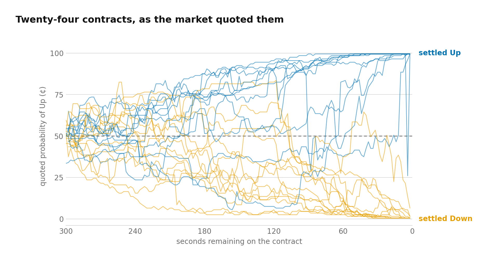
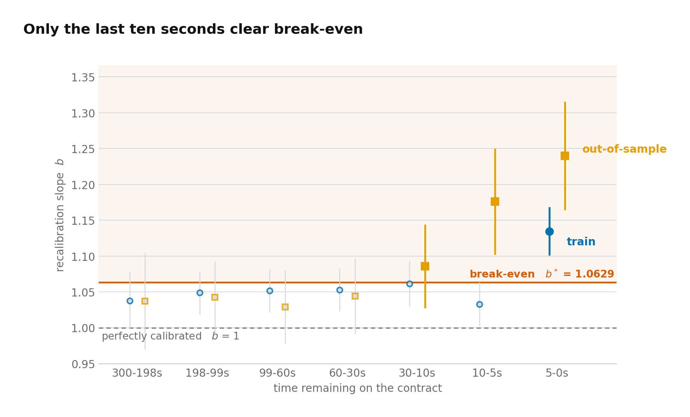
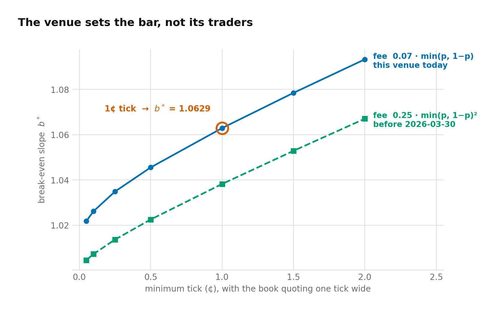
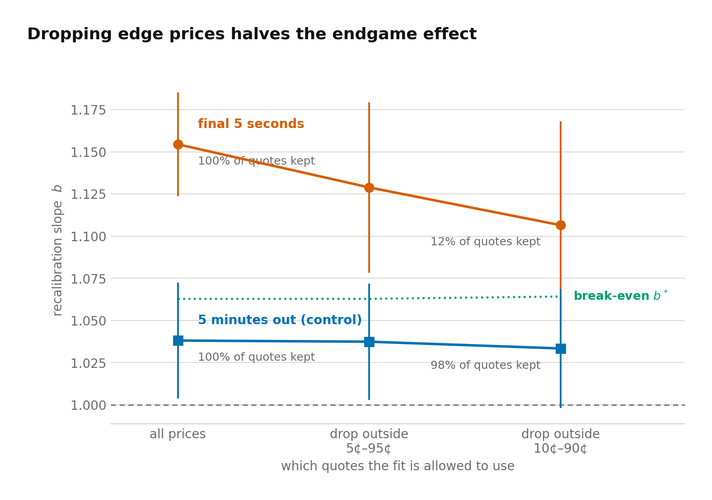
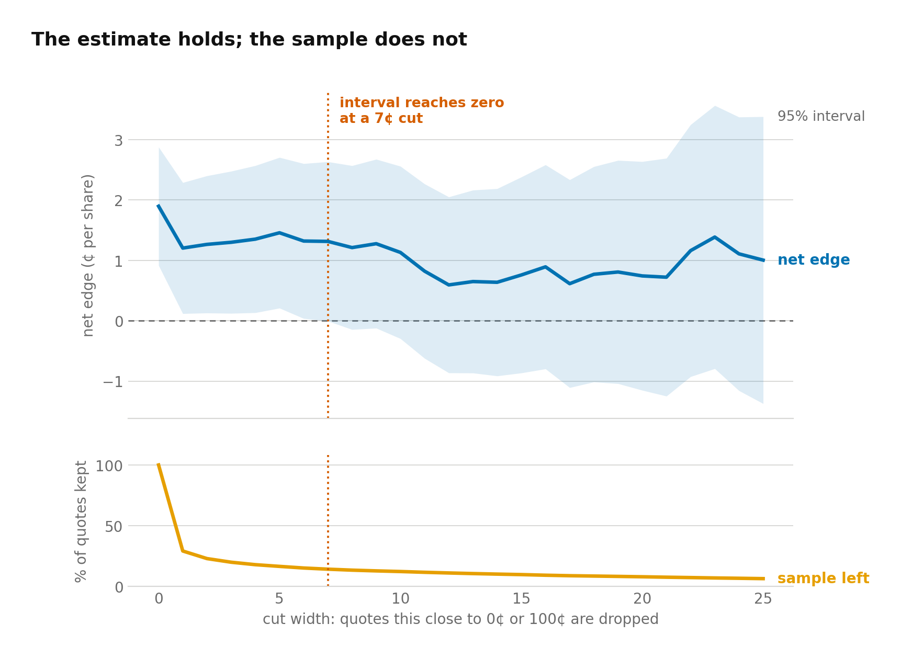

# polymarket-btc-calibration

Are **Polymarket's BTC Up/Down contracts** priced correctly? This is a study of
the 5-minute series, built from Polymarket's public order-book archive.

Prediction markets price probability directly: a contract quoted at 80¢ should
settle Up 80% of the time.



Each line is one contract's quoted probability of Up across its five-minute
life. They open near even odds, move with Bitcoin, and pin to 0¢ or 100¢ as the
outcome settles.

Those quotes hold to within a cent of the truth for most of a contract's life.
**In the final five seconds they do not.** Prices there sit too close to even
odds, by 7.8 standard errors in training and 6.2 out of sample, and the gap is
wide enough to clear Polymarket's published cost of trading.

What that is worth is the harder question. Part of the effect is made by
Polymarket's 1¢ price grid rather than by the market, and separating the two is
most of the job. Three independent tests put it at roughly half. What is left is
a positive estimate too imprecise to confirm, and measured execution says it
cannot be captured anyway.

---

## The contract

A new BTC Up/Down market opens every 5 or 15 minutes and asks whether Bitcoin
will be higher at the close of the window than at its open.

- One share, Up or Down. The winner pays $1.00, the loser $0.
- A share trading at 80¢ states an 80% probability.
- Settlement uses a Chainlink oracle print at the market's end.

A fixed schedule and a mechanical settlement rule give thousands of independent,
identically structured forecasts with known outcomes. The effect under study
lasts seconds, so the measurement has to resolve seconds. Throughout, the
closing seconds of a window are the **endgame**.

---

## Part 1. Data

### Construction

Polymarket's public order-book archive, from 2026-02-21 onward, holds every
snapshot, level delta and fill. Events are replayed in time order onto a 1-second
grid of best bid, best ask, midpoint, resting size and volume. One row is one
**quote-second**, the unit used throughout.

```
quote-second  :  one market, one second
mid           :  (best bid + best ask) / 2
Up-space      :  a Down bid at x  ==  an Up ask at 1 - x
settlement    :  finalPrice >= priceToBeat  ->  Up
```

Three conventions govern the grid:

- **No look-ahead.** Second `s` uses the last event at or before `s`, and the
Binance bar joined at `s` is its open, never its close.
- **State carries, validity does not.** The last quote is carried forward, but a
second is blanked unless it has a two-sided uncrossed quote under 30s stale.
- **Single price space.** Folding the Down book into Up-space stops a Down-side
quote reading as missing Up-side liquidity.

Zero bids are kept. They are real quotes, and they sit at the extreme prices
where the endgame result lives. Dropping them would remove 4.3% of quote-seconds
at a median midpoint of half a cent. Spot is Binance BTCUSDT 1-second klines;
strike (`priceToBeat`) and settlement print (`finalPrice`) come from market
metadata.

Three checks pass. Every settlement recomputes from the stated rule without
exception; mid changes cross-correlated against Binance returns peak at `k = 0`
over ±10 seconds, so the book is not lagged; and staleness stays near zero
through the final seconds, so the endgame is not measured on a frozen book.

### The fee boundary, and what the tick does

Polymarket changed its taker fee partway through the archive. Makers pay none in
either regime.

| Taker fee per share | Before 2026-03-30 | From 2026-03-30 |
| --- | --- | --- |
| Formula | `0.25 · min(p, 1-p)²` | `0.07 · min(p, 1-p)` |
| At 50¢ | 6.25¢ | 3.50¢ |
| At 90¢ | 0.25¢ | 0.70¢ |
| Used in the fits | no | yes |

The last old-schedule window opens 2026-03-29 and the first new one 2026-03-30,
with no day carrying both, so **every window opening before 2026-03-30 is
excluded from every fit**.

The minimum tick is set per market, not per date, and both grids run side by side
in the same series with no scheduling pattern:

| | 1¢ tick | 0.1¢ tick |
| --- | --- | --- |
| Share of contracts | ~60% | ~40% |
| Endgame quotes on a sub-cent price | 0.0% | 6.5% |
| Median half-spread | 0.500¢ | 0.500¢ |

Permission to price finer is not the same as using it. Both groups quote the same
half-spread, so what binds is the convention market makers price on, not
Polymarket's minimum. That is why [Part 3](#part-3-the-cost-threshold) uses a
0.5¢ half-spread throughout, and why the per-market tick becomes a natural
experiment in [Part 4](#part-4-the-tick-artifact).

### Selection

Two filters stand between the contracts that existed and the ones fitted.

Contracts open on a fixed schedule, 288 five-minute contracts a day, so coverage
is exact: the fitted sample captures **88.7% in training and 83.6% out of
sample**. The missing 11% and 16% never reached the archive. I checked those gaps
for structure and found none, so I treat them as faults in the public archive
rather than as anything correlated with what is being measured.

The coverage gate is far smaller. A window enters if at least 90% of seconds 1 to
300 carry a valid two-sided book, which removes about 2% of what reaches the
archive; admitted windows average 4.9997 of the 5 seconds in the final bucket. It
looks only at the window's end, where the result lives, because a book that
vanishes near the close most likely vanishes because the price is moving.

### Which contract, and how it is split

The BTC 5-minute contract runs the same mechanism, underlying and settlement rule
as the 15-minute, at three times the contracts per unit of calendar time.

| | |
| --- | --- |
| Train | window opens 2026-03-30 to 2026-05-31 |
| Out-of-sample | window opens 2026-06-01 onward |
| Excluded | every window opening before 2026-03-30 (previous fee schedule) |
| Known gap | June 13 to 28 missing from the archive |

Every boundary applies to the window's open, and the split is chronological,
since adjacent windows share a volatility regime and often the same underlying
price move.

Estimates are cut by time to close, on a grid that tightens as the close
approaches:

```
300-198s | 198-99s | 99-60s | 60-30s | 30-10s | 10-5s | 5-0s
```

Boundaries are fractions of the horizon (1.00, 0.66 and 0.33 of 300 seconds) with
a fine tail, set in [`config.py`](config.py) before any outcome was examined and
not varied since.

Built by [`sample.py`](sample.py).

---

## Part 2. Calibration

### The model

A forecaster is calibrated if stated probabilities match outcome frequencies in
the long run. Here the forecaster is the market and the forecast is the
midpoint, `mid = (best bid + best ask) / 2`.

Recovering the shape of any departure needs a model. The logit maps `[0, 1]` onto
the real line and the sigmoid inverts it, allowing a linear fit to a relationship
bounded at both ends:

```
logit(p) = ln( p / (1 - p) )        σ(x) = 1 / (1 + e^(-x))

P(Up | mid = p) = σ( a + b · logit(p) )
```

| | Meaning | Calibrated value |
| --- | --- | --- |
| `a` | Level. Systematic bias toward Up or Down. | `a = 0` |
| `b` | Slope. Whether probabilities are spread too far apart or not far enough. | `b = 1` |

At `a = 0`, `b = 1` this reduces to `P = p`. Where `b > 1` the truth lies further
from 50% than the quote: at `b = 1.077`, a quoted 80¢ settles Up 81.7% of the
time and a quoted 20¢ settles Up 18.4%. Favourites win more often than
advertised and longshots less often. That is the favourite-longshot bias.

### Fit

Fitted separately on each split, against `b = 1`:

| Bucket (BTC 5m) | train `b` | s.e. | `z` vs 1 | OOS `b` | s.e. | `z` vs 1 |
| --------------- | --------- | ------ | ----------- | --------- | ------ | ----------- |
| 300–198s        | 1.038     | 0.0203 | +1.87       | 1.037     | 0.0345 | +1.07       |
| 198–99s         | 1.049     | 0.0156 | +3.14       | 1.042     | 0.0256 | +1.64       |
| 99–60s          | 1.052     | 0.0154 | +3.38       | 1.029     | 0.0262 | +1.11       |
| 60–30s          | 1.053     | 0.0154 | +3.44       | 1.044     | 0.0271 | +1.62       |
| 30–10s          | 1.062     | 0.0160 | +3.88       | 1.086     | 0.0298 | +2.89       |
| 10–5s           | 1.033     | 0.0157 | +2.10       | 1.176     | 0.0378 | +4.66       |
| **5–0s**        | **1.135** | 0.0173 | **+7.80**   | **1.240** | 0.0386 | **+6.22**   |

### Reading the standard errors

Two columns in that table need unpacking, since every claim that follows rests on
them.

**The standard error** is how much the fitted `b` would move if the same
measurement were repeated on a different three months of contracts. The fit
returns one number, but that number comes from a finite sample, so it carries
uncertainty. A slope of 1.135 with a standard error of 0.0173 means the estimate
would typically land within about 0.017 of 1.135 on a rerun.

**`z`** is the gap between the estimate and the benchmark, measured in standard
errors:

```
z = (b - benchmark) / s.e.
```

At `z = 2` the gap is twice the noise, which happens about 5% of the time by
chance alone. At `z = 7.80` it is essentially not chance. The benchmark is `b = 1`
in the table above and `b*` in [Part 3](#part-3-the-cost-threshold), and that
swap is the whole argument.

**Clustering** decides how large the standard error comes out. The rows are not
independent: a 5-minute window contributes roughly 300 quote-seconds, but all 300
share one outcome, since Bitcoin either ended higher or it did not. Counting them
as 300 independent observations would make the sample look far more informative
than it is and shrink the standard error by more than tenfold. Clustering by
window measures the variation *between* windows instead, so each window counts
once. All standard errors are clustered by window, and
[Part 4](#part-4-the-tick-artifact) reruns the key result clustered by day, which
is stricter still.

### What the fit says

Every slope exceeds 1, so in both halves of the sample the market's prices sit
too close to even odds. The gap is small away from the close, around 1.03 to
1.06, and grows sharply in the last ten seconds. From 30 seconds in, the
out-of-sample estimate exceeds the training one in every bucket, which is the
opposite of an overfitting signature.

Intercepts are estimated jointly and none is individually significant, the
largest `|z|` on `a` across all fourteen bucket-splits being 1.27. Their signs
are not random, though: training intercepts are positive in all seven buckets and
out-of-sample intercepts negative in six of seven. That does not license setting
`a = 0`, so [Part 3](#part-3-the-cost-threshold) carries both coefficients and
their covariance into the economics.

At millions of observations, effects far smaller than anything tradable are
resolvable. Every `z` above says a departure exists, not that it is large enough
to act on. That needs a different benchmark.

Fitted by [`calibration.py`](calibration.py).

---

## Part 3. The cost threshold

Acting on a miscalibration requires the correction to exceed what correcting it
costs. Both costs are published, so the comparison is exact and nothing in this
section is estimated from outcomes.

### The two costs

Trading does not happen at the midpoint. Buying means paying the ask and selling
means hitting the bid, so crossing costs half the spread. The minimum tick is 1¢,
so the minimum spread is 1¢ and the minimum possible half-spread is **0.5¢**.
That floor is used throughout, and observed spreads can only be wider, so every
threshold below is a lower bound on the true cost.

Takers pay a price-dependent fee and makers pay none:

```
fee per share = r · min(p, 1-p)^e          r = 0.07,  e = 1
```

The `min(p, 1-p)` term peaks at 50¢ and falls to zero at the extremes: 3.5¢ per
share at even money, 0.7¢ at 90¢.

### The net edge

Observe price `p`, apply the recalibration from
[Part 2](#part-2-calibration) to get `q = σ(a + b · logit(p))`. The gross edge is
`q - p` in cents per share, and the net edge pays both costs:

```
net edge  =  100·(q - p)  -  half-spread  -  100·r·min(p, 1-p)^e
```

The economic question is whether the best net edge anywhere on the price surface
is positive. Both `a` and `b` move it and are estimated together, so the
confidence interval carries the uncertainty in both and their covariance. Net
edge is always evaluated at the most favourable price, assuming a tick-tight book
and instant execution, so every figure derived from it is a ceiling rather than a
forecast.

### `b*`

The same arithmetic read as a threshold. `b*` is the smallest slope at which the
best net edge is exactly zero, holding `a = 0`. Below it, a directionally
unbiased recalibration recommends no trade that survives costs.

```
b* = 1.0629
```

Fixing `a = 0` is by construction: with the level term free, the break-even slope
is a curve rather than a number. That keeps `b*` a clean scalar depending only on
published venue parameters, and therefore comparable across venues. The economic
test uses the net edge; `b*` describes the surface.

Computed by [`bstar.py`](bstar.py), which needs no data and runs on its own.

### The slopes against the threshold

The same estimates as Part 2, compared against `b*` instead of 1:

| Bucket (BTC 5m) | train `b` | s.e. | `z` vs `b*` | OOS `b` | s.e. | `z` vs `b*` |
| --------------- | --------- | ------ | ----------- | --------- | ------ | ----------- |
| 300–198s        | 1.038     | 0.0203 | −1.22       | 1.037     | 0.0345 | −0.75       |
| 198–99s         | 1.049     | 0.0156 | −0.89       | 1.042     | 0.0256 | −0.82       |
| 99–60s          | 1.052     | 0.0154 | −0.71       | 1.029     | 0.0262 | −1.29       |
| 60–30s          | 1.053     | 0.0154 | −0.64       | 1.044     | 0.0271 | −0.70       |
| 30–10s          | 1.062     | 0.0160 | −0.05       | 1.086     | 0.0298 | +0.78       |
| 10–5s           | 1.033     | 0.0157 | −1.90       | 1.176     | 0.0378 | +2.99       |
| **5–0s**        | **1.135** | 0.0173 | **+4.17**   | **1.240** | 0.0386 | **+4.59**   |



Bars are 95% intervals. The dashed line is a perfectly calibrated market and the
solid one is break-even, `b* = 1.0629`; estimates below it are greyed out.

Nothing about the data changed between the two tables. The same fits are
compared against a different benchmark, and the answer changes with it. Buckets
three and four standard errors from calibration sit within one standard error of
worthlessness. In training
every bucket including 10–5s lies below break-even, and out of sample every
bucket through 60–30s does. No shortfall is individually significant; what
matters is that every one points the same way.

The last ten seconds are the exception, in both splits. Part 4 asks whether that
survivor is real.

### `b*` belongs to the venue

`b*` is a function of the tick and the fee alone, so it can be evaluated for any
configuration, holding the book tick-tight:

| Minimum tick | Half-spread | `b*` at `r`=.07, `e`=1 | `b*` at `r`=.25, `e`=2 |
| ------------ | ----------- | ---------------------- | ---------------------- |
| 0.1¢         | 0.05¢       | 1.0261                 | 1.0072                 |
| 0.25¢        | 0.125¢      | 1.0348                 | 1.0136                 |
| 0.5¢         | 0.25¢       | 1.0455                 | 1.0225                 |
| **1.0¢**     | **0.5¢**    | **1.0629** *(here)*    | 1.0382                 |
| 2.0¢         | 1.0¢        | 1.0932                 | 1.0670                 |



The tick alone moves the threshold from roughly 1.03 to 1.09. Two venues hosting
identical contracts, with equally sharp participants and identical
miscalibration, therefore have different `b*`. The one with the coarser tick
looks more efficient, not because its prices are better but because more of its
miscalibration sits below the cost of reaching it.

---

## Part 4. The tick artifact

### Mechanism

Prices move on a 1¢ grid. Mid-range that is adequate resolution. Near the
boundaries it is not, and in the endgame almost every quote is near a boundary
because the outcome is nearly decided: **83% of final-five-second quote-seconds
sit outside 5–95¢**, against 0.4% five minutes earlier.

A market whose belief is 99.4% cannot quote it. The grid offers 99¢ or 100¢, and
100¢ is not a live quote, so it shows 99¢. So does a market believing 98.6%, and
so does one believing 99.9%. The 99¢ bucket holds everything from roughly 98.5%
to 100%, and
in the endgame that mass skews upward, because that is where markets go as they
resolve. Its settle rate recovers the average belief inside it, which exceeds
99%. The mirror case happens at 1¢.

High prices settling more often than quoted and low prices less often is the
signature of `b > 1`. The grid reproduces the pattern being measured, as a
rounding artifact.

### Test

If that mechanism drives the result, discarding boundary prices should shrink
`b` where the boundary binds and leave it alone where it does not. `b*` is
recomputed on each restricted range, since a slope estimated only on 10¢–90¢
quotes cannot be traded at 92¢.

| Sample (BTC 5m, 5–0s) | `b` | s.e. | `b*` | `z` vs `b*` | net edge | 95% CI | share |
| --------------------- | ----- | ------ | ------ | ---- | ------ | -------------- | ----- |
| All prices            | 1.154 | 0.0157 | 1.0629 | 5.80 | +1.90¢ | [0.92, 2.88]   | 100.0% |
| Interior 5–95¢        | 1.129 | 0.0258 | 1.0629 | 2.56 | +1.46¢ | [0.21, 2.70]   | 16.5% |
| Interior 10–90¢       | 1.106 | 0.0315 | 1.0642 | 1.33 | +1.13¢ | [−0.30, 2.56]  | 12.3% |

Control, five minutes from the close, where the boundary does not bind:

| Sample (BTC 5m, 300–198s) | All prices | Interior 5–95¢ | Interior 10–90¢ |
| ------------------------- | ---------- | -------------- | --------------- |
| `b`                       | 1.038      | 1.037          | 1.033           |
| share of quote-seconds    | 100.0%     | 99.6%          | 98.2%           |



The control is the internal check: five minutes out almost every quote is already
interior, so the restriction barely moves the slope. In the final five seconds it
discards 88% of the sample.

### Sliding the cutoff

Three cutoffs are too few to tell whether the result fades gradually, drops off a
cliff, or is just noise. So instead of picking three, slide the cutoff through
every value from 0¢ to 25¢ and watch what happens:



The estimate and the evidence behind it move in opposite directions. The edge
stays positive at **every** cutoff, between +0.59¢ and +1.90¢, and never trends
toward zero. The sample collapses: 29% of quotes survive a 1¢ cutoff and 12%
survive 10¢. The confidence interval admits zero from **7¢** onward, and it does
so because the data ran out, not because the estimate moved.

### A natural experiment on the tick

The restriction and the sweep both delete data. The exchange supplies a test that
deletes nothing: because the tick is set per market, roughly 40% of the endgame
sample may quote in tenths of a cent while the rest may not. If `b > 1` is
rounding, markets allowed a finer grid should show less of it.

| Minimum tick | `b` | s.e. | net edge | sub-cent quotes | median half-spread | windows |
| ------------ | ----- | ------ | ------ | ------ | ------ | ------ |
| 1¢           | 1.178 | 0.0212 | +2.84¢ | 0.0%   | 0.500¢ | 12,290 |
| 0.1¢         | 1.120 | 0.0229 | +0.53¢ | 6.5%   | 0.500¢ | 8,817  |

The coarse-tick markets carry the higher slope, by **0.058** with a standard
error of 0.0312, or `z = 1.86`. That is the direction the artifact predicts, at
about the magnitude the interior restriction finds (0.042), by a method that
discards nothing.

Three things weaken it: the difference is only marginally significant; the tick
is assigned by the exchange, so the two groups were not chosen at random and
could differ in ways nobody controlled; and they are not perfectly matched, with
87.7% of fine-tick endgame quotes at the extremes against 80.5% of coarse-tick
ones. Outcomes are balanced, at Up-rates of 0.5006 against 0.5002, and the tick
shows no scheduling pattern across the hour, so the obvious confounds are absent
rather than merely unexamined.

One thing strengthens it. The treatment is far more concentrated than 6.5%
suggests: **99.5% of the sub-cent quotes sit at extreme prices**, which is
exactly where rounding distorts the measurement and where a single observation
pulls hardest on the fitted line.

### Result

Three methods with different weaknesses agree that roughly half the endgame slope
is the grid. The slope falls from 1.154 to 1.106, removing about half the excess
above break-even (0.092 to 0.042), and the net edge falls from +1.90¢ to +1.13¢.

What survives is not a residue of the same artifact: the interior fit uses only
10¢–90¢ quotes, where a 1¢ grid is fine relative to the distances involved. That
is a property of what the market believes rather than of the price grid, and I
have no explanation for it.

**The correction does not settle the question, and cannot at this sample size.**
At 10–90¢ the net edge is +1.13¢ with a 95% interval of [−0.30, 2.56], and the
slope gives `z = 1.33` against `b*`. Out of sample alone the interior estimate is
useless: `b = 1.140` with a standard error of 0.0788, a slope interval of
[0.99, 1.29] that contains a perfectly calibrated market, and an edge interval of
[−2.06, 4.41]. The one test that both corrects for the grid and uses held-out
data has too little left to say anything, so the pooled result leans on the
training half. It is not a confirmation.

Clustering by window may itself be too fine, since consecutive contracts share a
volatility regime. Re-clustering by day widens the interior slope's standard
error from 0.0315 to 0.0465 and the edge interval to [−1.00, 3.26]. `b*`
contributes no sampling error, being computed from the published tick and fee, so
the intervals quoted are on the fit alone.

---

## Part 5. Can it be captured?

Every figure above is a ceiling: it assumes the fit is right and that a trade
happens at the single best price on the surface, instantly. Whether any of it
reaches an account is a different question. I ran that test, and this section is
my account of what I saw.

> The numbers here come from live trading, so the code and order records behind
> them contain information I am not publishing. Everything else in this document
> is drawn from the committed artifacts.

I re-ran the final five seconds looking for moments where the modelled edge
exceeded a threshold `τ`, scoring each at the quote that fired it and assuming
the order filled instantly and in full. I picked τ\* on train and report the
out-of-sample figure at that same τ\*. At τ\* = 1¢, across 2,215 train triggers
and 432 out of sample, the trade returns **+1.38¢ per share in train and +0.90¢
out of sample**, at a mean trigger price of 87.8¢. That is the same region of the
surface the calibration result describes.

I then added realism in three steps, each still an upper bound:

| Execution model | train ¢/share | OOS ¢/share | fill rate |
| --------------- | ------------- | ----------- | --------- |
| Fill at the triggering quote, zero latency | +1.38 | **+0.90** | assumed 100% |
| Fill one second later, always | −0.25 | −0.67 | assumed 100% |
| Fill one second later, killed if the price moved past the limit | −4.65 | **−3.20** | **25%** |

Only the first is unreachable. The second is the naive latency model, and it is
itself too generous, since it books a fill at whatever price resulted when a real
order that no longer matches would have been cancelled. Live orders settled that
for me: 122 of 165 filled, and all 43 misses were kills rather than worse fills.

The realistic model is worse than the naive one despite trading a quarter as
often, which puts the problem in fill selection rather than fill rate. A missed
fill costs nothing. A buy order fills only when the price has not risen, and in
the final seconds a falling ask is the market revising down the probability of
the outcome just bought. Orders therefore transact in the states where the market
moved against them and are cancelled in the states where it moved in their
favour.

Running the broader signal live, I recorded 2.57¢ of slippage over 108 settled
fills against a modelled edge near one cent. Those fills averaged 64¢, a
different region of the surface, so I treat that as corroboration rather than
measurement. One cent of slippage is already enough.

None of this is decisive on its own. The out-of-sample trigger set is 432, and at
zero assumed slippage its interval is [−2.10, +3.68]¢ per share. What carries
weight is that every configuration I could actually implement lands negative in
both splits.

---

## Conclusions

1. **The benchmark decides the answer, not the data.** The interior endgame
estimate stands at `z = 3.37` against a perfect market. The edge it implies is
+1.13¢ per share with an interval that includes zero. Only the question changed.

2. **`b*` belongs to the exchange.** It is set by the tick and the fee, and
moving either moves it by more than the entire measured miscalibration. A venue
can look more efficient by coarsening its grid, without its participants becoming
any sharper.

3. **The measurement and the effect live at the same prices.** The 1¢ grid
produces roughly half the endgame slope's excess over break-even and sets the
cost floor that prices what remains. Removing the artifact costs 88% of the
sample, so the correction and the loss of power to detect what survives it are
the same act.

4. **What survives cannot be confirmed, and separately cannot be captured.** The
edge is positive at every interior cutoff and never trends toward zero, but no
interval excludes zero once the cutoff passes 7¢, and the out-of-sample interior
test has no power. Independently of that, every implementable execution model
returns nothing: granting the edge in full, execution still eats it.

---

## Limitations

- One venue, one underlying, one contract length, about three months of fitted
sample. Whether `b*` binds elsewhere is untested.
- 11% of training contracts and 16% of out-of-sample contracts never reached the
archive, including a permanent gap from June 13 to 28.
- The interior result rests on 12.3% of final-five-second observations and is not
significant on its own. Its held-out counterpart cannot rule out a perfectly
calibrated market.
- Clustering by window is likely too fine. Day clustering widens every interval
and is reported above rather than adopted as the headline.
- Modelled costs assume a tick-tight book, so every `b*` is a lower bound and
every net edge an upper bound.
- This is taker economics. The maker side, where the fee is zero but adverse
selection is not, is not covered.
- No mechanism is proposed for why `b > 1` arises.

I chose to keep the execution side of Part 5 out of this repository, because the
code and order records behind it contain live trading information. That section
is therefore the one part a reader cannot check, and it rests on 432
out-of-sample triggers and 108 live fills. Everything else here runs from the
committed artifacts.

---

## Further work

The binding constraint is data, not method. Roughly 11% of training contracts and
16% of out-of-sample ones never reached the public archive, and the interior test
that corrects for the price grid keeps only 12.3% of endgame quotes, which leaves
it without the power to confirm or reject what it measures. A cleaner feed,
recorded directly rather than pulled from the archive, would close both gaps: it
would fill the missing windows, including June 13 to 28, and give the interior
test enough observations to settle the question the current sample cannot.

---

## Repository layout

| path | what it does |
| --- | --- |
| [`bstar.py`](bstar.py) | Net edge, its confidence interval, and `b*` (Part 3). Published parameters only, no data. |
| [`config.py`](config.py) | Sample boundaries: the fee cut, the split, the coverage gate, the bucket grid. Fixed, not tunable. Data paths come from `config.toml`. |
| [`sample.py`](sample.py) | Builds the fitted dataset from the 1-second grids (Part 1). |
| [`calibration.py`](calibration.py) | The fits (Parts 2 to 4), the cutoff sweep, the tick experiment, the coverage census, the sampled price paths. |
| [`figures.py`](figures.py) | The five figures, drawn from `artifacts/`. |
| `artifacts/` | Seven CSVs: fit coefficients, cutoff sweep, tick experiment, coverage census, the window- and day-clustered restriction tables, and the price paths behind the opening figure. Every table and figure in this document comes from these. |
| `figures/` | The five PNGs, regenerated by `figures.py`. |

Python 3.11 or newer.

```
pip install -e .
python bstar.py     # Part 3 in full; needs no data
python figures.py   # redraws figures/ from artifacts/
```

`bstar.py` is self-contained: the cost threshold depends only on Polymarket's
published tick and fee, so all of Part 3 recomputes from nothing. `figures.py`
redraws every figure from the committed artifacts.

The 1-second grids behind Parts 1, 2 and 4 are not published here, so
`sample.py` and `calibration.py` are included to show how the sample and the
fits were built rather than to be re-run.

Released under the [MIT licence](LICENSE).
